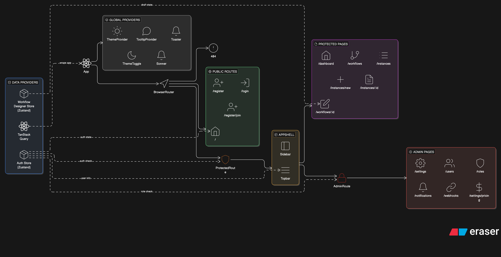

# Multi-Tenant Workflow Engine — Frontend

The browser-based SaaS frontend for the Workflow Engine platform. Provides a full-featured tenant dashboard, a drag-and-drop visual workflow designer powered by React Flow (`@xyflow/react`), an instance management console, role-based access control, notification configuration, and webhook management.

**Framework:** React 18 + Vite 5 + TypeScript 5  
**State Management:** Zustand (client state) + TanStack Query v5 (server state)  
**UI:** shadcn/ui + Radix UI + TailwindCSS

---

## Table of Contents

- [What This Application Does](#what-this-application-does)
- [Tech Stack](#tech-stack)
- [Project Structure](#project-structure)
- [Prerequisites](#prerequisites)
- [Local Development Setup](#local-development-setup)
- [Environment & Proxy Configuration](#environment--proxy-configuration)
- [Running the Application](#running-the-application)
- [Running Tests](#running-tests)
- [Building for Production](#building-for-production)
- [Application Routes](#application-routes)
- [Key Architecture Decisions](#key-architecture-decisions)
- [State Management Guide](#state-management-guide)
- [API Client Design](#api-client-design)
- [Component Structure](#component-structure)
- [Scripts Reference](#scripts-reference)
- [Related Documentation](#related-documentation)

---

## What This Application Does

| Feature                    | Description                                                                                                                                                          |
| -------------------------- | -------------------------------------------------------------------------------------------------------------------------------------------------------------------- |
| **Tenant Onboarding**      | Register a new tenant organisation and provision the first Admin user                                                                                                |
| **Workflow Designer**      | Drag-and-drop canvas (`@xyflow/react`) to create state machines — add states (nodes), connect transitions (edges), and attach JSON business rules to each transition |
| **Workflow Publishing**    | Version-lock a workflow definition as an immutable snapshot; deprecate old versions                                                                                  |
| **Instance Management**    | Browse all workflow instances; create new instances from published definitions; execute state transitions with role-based permission enforcement                     |
| **Audit Log Viewer**       | Paginated, filterable view of the append-only audit trail for every workflow event                                                                                   |
| **User & Role Management** | Admin-only CRUD for users and roles within the tenant's RBAC model                                                                                                   |
| **Notification Templates** | Manage email templates for workflow events                                                                                                                           |
| **Webhook Configuration**  | Configure and test outbound webhooks; view delivery logs                                                                                                             |
| **Dashboard**              | Aggregated stats — active instances, recent transitions, workflow health metrics                                                                                     |
| **Settings**               | Tenant branding, plan, and configuration                                                                                                                             |

---

## Tech Stack

| Concern              | Technology                      | Version                |
| -------------------- | ------------------------------- | ---------------------- |
| Framework            | React                           | `^18.3.1`              |
| Build Tool           | Vite (SWC transpiler)           | `^5.4.19`              |
| Language             | TypeScript                      | `^5.8.3`               |
| Styling              | TailwindCSS                     | `^3.4.17`              |
| UI Components        | shadcn/ui (Radix UI primitives) | varies per component   |
| Icon Library         | lucide-react                    | `^0.462.0`             |
| Client State         | Zustand                         | `^5.0.11`              |
| Server State / Cache | TanStack Query (React Query)    | `^5.83.0`              |
| HTTP Client          | Axios                           | `^1.13.6`              |
| Workflow Canvas      | @xyflow/react (React Flow)      | `^12.10.1`             |
| Routing              | react-router-dom                | `^6.30.1`              |
| Form Handling        | react-hook-form + zod           | `^7.61.1` / `^3.25.76` |
| Data Tables          | @tanstack/react-table           | `^8.21.3`              |
| Charts               | recharts                        | `^2.15.4`              |
| Date Utilities       | date-fns                        | `^3.6.0`               |
| Notifications (UI)   | sonner                          | `^1.7.4`               |
| Testing              | vitest + @testing-library/react | `^3.2.4`               |
| Linting              | ESLint 9 (flat config)          | `^9.32.0`              |

---

## Project Structure

```
frontend/
├── index.html                          # Vite entry HTML
├── vite.config.ts                      # SWC plugin, /api proxy to :3000, @ alias
├── tailwind.config.ts                  # TailwindCSS config + typography plugin
├── postcss.config.js
├── components.json                     # shadcn/ui config
├── tsconfig.json
├── vitest.config.ts
├── src/
│   ├── main.tsx                        # React root, QueryClientProvider, ThemeProvider
│   ├── App.tsx                         # Route definitions (all pages)
│   ├── pages/
│   │   ├── auth/
│   │   │   ├── LoginPage.tsx           # JWT login form
│   │   │   ├── RegisterTenantPage.tsx  # New tenant onboarding
│   │   │   └── SelfRegisterPage.tsx    # User self-registration via invite
│   │   ├── DashboardPage.tsx           # Summary stats and recent activity
│   │   ├── WorkflowsPage.tsx           # Workflow definitions list
│   │   ├── WorkflowDesignerPage.tsx    # React Flow canvas editor
│   │   ├── InstancesPage.tsx           # Workflow instances list + filters
│   │   ├── CreateInstancePage.tsx      # Launch a new workflow instance
│   │   ├── InstanceDetailPage.tsx      # Instance detail + transition execution
│   │   ├── UsersPage.tsx               # User management (Admin only)
│   │   ├── RolesPage.tsx               # Role management (Admin only)
│   │   ├── NotificationsPage.tsx       # Notification template management
│   │   ├── WebhooksPage.tsx            # Webhook config + delivery logs
│   │   ├── SettingsPage.tsx            # Tenant settings
│   │   ├── PricingPage.tsx             # Plan / pricing information
│   │   └── NotFound.tsx               # 404 fallback
│   ├── components/
│   │   ├── ui/                         # shadcn/ui generated components (owned by you)
│   │   │   ├── button.tsx
│   │   │   ├── dialog.tsx
│   │   │   ├── dropdown-menu.tsx
│   │   │   ├── table.tsx
│   │   │   └── ...                     # 30+ Radix-backed components
│   │   ├── layout/
│   │   │   └── AppShell.tsx            # Sidebar + header layout wrapper
│   │   ├── auth/
│   │   │   ├── ProtectedRoute.tsx      # Redirects unauthenticated users to /login
│   │   │   └── AdminRoute.tsx          # Restricts routes to Admin role
│   │   ├── common/
│   │   │   └── ThemeToggle.tsx         # Dark/light mode toggle
│   │   └── ThemeProvider.tsx           # next-themes wrapper
│   ├── stores/
│   │   ├── auth-store.ts               # Zustand + persist: session, tokens, user
│   │   └── workflow-designer-store.ts  # Zustand: canvas state, selected nodes/edges
│   ├── lib/
│   │   ├── api-client.ts               # Axios instance: Bearer JWT, CSRF fetch, 401 auto-refresh
│   │   ├── query-client.ts             # TanStack Query config: staleTime=2min, smart retry
│   │   └── query-keys.ts               # Centralized query key factories (all domains)
│   └── types/                          # Shared TypeScript type definitions
├── public/                             # Static assets
└── package.json
```

---

## Component Diagram



[Component Diagram](./docs/FRONTEND-COMPONENT-HIERARCHY-DIAGRAM.md)

## Prerequisites

| Requirement     | Version            | Notes                                                     |
| --------------- | ------------------ | --------------------------------------------------------- |
| **Node.js**     | 20+                | Or Bun — `bun run dev` also works                         |
| **npm**         | 10+                | Or Bun — `bun install` is faster                          |
| **Backend API** | Running on `:3000` | Vite proxies `/api/*` requests to `http://localhost:3000` |

---

## Local Development Setup

### 1. Install dependencies

```bash
cd frontend
npm install
# or: bun install
```

### 2. Start the backend

The frontend proxies all `/api/*` requests to the backend at `http://localhost:3000`. Start the backend first (see the backend README) — the frontend cannot authenticate or fetch data without it.

```bash
# In the backend directory
bun run start:dev
```

### 3. Start the development server

```bash
npm run dev
# or: bun run dev
```

The app is available at **http://localhost:8000**.

Hot Module Replacement (HMR) is powered by Vite + SWC — most changes reflect in the browser in under 100 ms without a full page reload. The HMR overlay is disabled (`hmr: { overlay: false }`) to avoid obscuring the React Flow canvas during workflow design.

---

## Environment & Proxy Configuration

The frontend has **no `.env` file** for local development — all configuration is either baked into `vite.config.ts` or handled at runtime by the backend.

### Vite dev proxy

All requests to `/api/*` are forwarded to `http://localhost:3000` (the NestJS backend):

```typescript
// vite.config.ts
proxy: {
  '/api': {
    target: 'http://localhost:3000',
    changeOrigin: true,
    secure: false,
  },
},
```

This means **no CORS errors in development** — the browser sees all traffic as same-origin. In production, configure your reverse proxy (Nginx, Kong, or the hosting platform's routing) to route `/api/*` to the backend service.

### Path alias

`@/` maps to `src/` everywhere — use `import { Button } from '@/components/ui/button'` throughout.

### Production build environment

For production deployments, set these at the platform / CDN level:

| Variable            | Example                   | Description                                                                  |
| ------------------- | ------------------------- | ---------------------------------------------------------------------------- |
| `VITE_API_BASE_URL` | `https://api.example.com` | Override if API is on a different domain (not needed behind a reverse proxy) |

---

## Running the Application

| Command              | Description                                   |
| -------------------- | --------------------------------------------- |
| `npm run dev`        | Start Vite dev server on port 8000 with HMR   |
| `npm run build`      | Production build to `dist/`                   |
| `npm run build:dev`  | Development-mode build (useful for debugging) |
| `npm run preview`    | Preview the production build locally          |
| `npm run lint`       | ESLint with flat config                       |
| `npm run test`       | Run vitest once                               |
| `npm run test:watch` | Run vitest in watch mode                      |

---

## Running Tests

Tests use **vitest** with **@testing-library/react** and `jsdom`:

```bash
# Single run
npm run test

# Watch mode (interactive)
npm run test:watch
```

Test files live alongside components as `*.test.tsx` or `*.spec.tsx` files, or in a `__tests__/` directory. The vitest config is in `vitest.config.ts`.

---

## Building for Production

```bash
npm run build
```

Output goes to `dist/`. The build uses Vite's Rollup bundler with:

- Tree-shaking across all imports
- TailwindCSS JIT — only used utility classes are emitted (typically 5–15 KB CSS)
- Code splitting per route — each page loads its own chunk; the workflow designer's `@xyflow/react` bundle does not block the dashboard load
- Asset fingerprinting — all filenames include a content hash for long-lived cache headers

To preview the production build locally:

```bash
npm run preview
# http://localhost:4173
```

Deploy the `dist/` directory to any static host (Vercel, Netlify, Render static site, S3 + CloudFront). Configure the host to serve `index.html` for all paths (single-page application routing).

---

## Application Routes

| Path             | Component                             | Auth Required | Role                               |
| ---------------- | ------------------------------------- | ------------- | ---------------------------------- |
| `/`              | Redirects to `/dashboard` or `/login` | —             | —                                  |
| `/login`         | `LoginPage`                           | No            | —                                  |
| `/register`      | `RegisterTenantPage`                  | No            | —                                  |
| `/register/join` | `SelfRegisterPage`                    | No            | —                                  |
| `/dashboard`     | `DashboardPage`                       | ✅            | Any                                |
| `/workflows`     | `WorkflowsPage`                       | ✅            | Any                                |
| `/workflows/:id` | `WorkflowDesignerPage`                | ✅            | Any (edit requires Admin/Designer) |
| `/instances`     | `InstancesPage`                       | ✅            | Any                                |
| `/instances/new` | `CreateInstancePage`                  | ✅            | Any                                |
| `/instances/:id` | `InstanceDetailPage`                  | ✅            | Any                                |
| `/users`         | `UsersPage`                           | ✅            | Admin                              |
| `/roles`         | `RolesPage`                           | ✅            | Admin                              |
| `/notifications` | `NotificationsPage`                   | ✅            | Admin                              |
| `/webhooks`      | `WebhooksPage`                        | ✅            | Admin                              |
| `/settings`      | `SettingsPage`                        | ✅            | Admin                              |
| `/pricing`       | `PricingPage`                         | ✅            | Any                                |
| `*`              | `NotFound`                            | —             | —                                  |

**Route protection:**

- `ProtectedRoute` wraps all authenticated routes — unauthenticated users are redirected to `/login`.
- `AdminRoute` wraps admin-only routes — non-admin users see a permission denied page.
- Auth state is read from `useAuthStore()` (Zustand persisted store).

---

## Key Architecture Decisions

### Why React + Vite?

`@xyflow/react` is the workflow canvas library — it is React-only with no equivalent in Vue or Svelte. Vite with `@vitejs/plugin-react-swc` provides near-instant HMR during development. See `11-FAQ.md §Q15`.

### Why TanStack Query + Zustand, not Redux?

State in this application falls into two categories:

- **Server state** (workflow definitions, instances, users): Fetched from the backend, cached, and invalidated on mutations. TanStack Query manages this with `staleTime: 2 minutes`, smart retry (no retry on `401`/`403`/`404`), and `queryClient.invalidateQueries()` on mutations.
- **Client state** (auth session, designer canvas): Lives in the browser only. Zustand's minimal API handles this without Redux's action/reducer boilerplate.

See `11-FAQ.md §Q17`.

### Why shadcn/ui?

`shadcn/ui` copies component source into your repository (via `npx shadcn-ui add <component>`). Components are Radix UI primitives styled with TailwindCSS. Zero runtime dependency, full accessibility via Radix, and unlimited customisation without fighting a third-party CSS-in-JS system. See `11-FAQ.md §Q18`.

---

## State Management Guide

### Auth Store (`src/stores/auth-store.ts`)

Zustand store with `persist` middleware — survives page refreshes via `localStorage`.

```typescript
interface AuthStore {
  user: AuthUser | null;
  accessToken: string | null;
  refreshToken: string | null;
  isAuthenticated: boolean;

  setSession: (user: AuthUser, tokens: Tokens) => void;
  setTokens: (tokens: Tokens) => void;
  logout: () => void;
}
```

**Key behaviours:**

- `setSession()` is called after a successful login response — stores user data and both tokens.
- `setTokens()` is called by the Axios interceptor after a successful token refresh — updates tokens without clearing user data.
- `logout()` clears all state and redirects to `/login`.
- The `user` object contains all JWT payload fields: `id`, `email`, `tenantId`, `tenantSlug`, `roles`, `plan`, `firstName`.

### Workflow Designer Store (`src/stores/workflow-designer-store.ts`)

Plain Zustand store — no persistence (ephemeral canvas state).

Manages: the React Flow node and edge arrays, the currently selected node/edge, draft state for unsaved changes, and the definition metadata (id, name, status). Reset on page unmount.

### TanStack Query

All server state is managed through TanStack Query. Query keys are centralised in `src/lib/query-keys.ts` — use these factories everywhere, never inline string keys:

```typescript
// src/lib/query-keys.ts
export const queryKeys = {
  workflows: {
    all: () => ["workflows"] as const,
    list: (filters?: WorkflowFilters) => ["workflows", "list", filters] as const,
    detail: (id: string) => ["workflows", "detail", id] as const,
    versions: (id: string) => ["workflows", "versions", id] as const,
  },
  instances: {
    all: () => ["instances"] as const,
    list: (filters?: InstanceFilters) => ["instances", "list", filters] as const,
    detail: (id: string) => ["instances", "detail", id] as const,
    auditLog: (id: string) => ["instances", "audit", id] as const,
  },
  // ... auth, users, roles, notifications, webhooks
};
```

**Cache configuration (`src/lib/query-client.ts`):**

| Setting                | Value                                 | Effect                                                       |
| ---------------------- | ------------------------------------- | ------------------------------------------------------------ |
| `staleTime`            | 2 minutes                             | Cached data is served without a refetch for 2 minutes        |
| `gcTime`               | 5 minutes                             | Inactive cache entries are garbage-collected after 5 minutes |
| `retry`                | Smart — no retry on `401`/`403`/`404` | Prevents infinite retry loops on auth/permission errors      |
| `refetchOnWindowFocus` | Default (true)                        | Refetches stale queries when the browser tab regains focus   |

---

## API Client Design

All HTTP requests go through the Axios instance in `src/lib/api-client.ts`.

### What it handles automatically

| Concern                 | Mechanism                                                                                                                                                                                               |
| ----------------------- | ------------------------------------------------------------------------------------------------------------------------------------------------------------------------------------------------------- |
| **Base URL**            | All requests use `/api` prefix — proxied to backend in dev, served by reverse proxy in prod                                                                                                             |
| **Bearer token**        | `Authorization: Bearer <accessToken>` injected from `useAuthStore.getState().accessToken` on every request                                                                                              |
| **CSRF token**          | Fetched once via `GET /api/auth/csrf-token` and attached as `X-CSRF-Token` header on all state-changing requests                                                                                        |
| **Token refresh**       | `401` response triggers a single `POST /api/auth/refresh` call; the original request is retried with the new token. If refresh also fails, `logout()` is called and the user is redirected to `/login`. |
| **Error normalisation** | Error responses are passed through to TanStack Query's `onError` handler — display via `sonner` toast in components                                                                                     |

### Making requests

Use TanStack Query hooks, never call the Axios instance directly from components:

```typescript
// ✅ Correct — server state via TanStack Query
const { data: instances, isLoading } = useQuery({
  queryKey: queryKeys.instances.list({ status: "active" }),
  queryFn: () =>
    apiClient.get("/api/workflow-instances", { params: { status: "active" } }).then((r) => r.data),
});

// ✅ Correct — mutations via useMutation
const executeTransition = useMutation({
  mutationFn: (payload: ExecuteTransitionDto) =>
    apiClient.patch(`/api/workflow-instances/${instanceId}/transitions`, payload).then((r) => r.data),
  onSuccess: () => {
    queryClient.invalidateQueries({ queryKey: queryKeys.instances.detail(instanceId) });
    toast.success("Transition executed successfully");
  },
});
```

---

## Component Structure

### `src/components/ui/`

All shadcn/ui components — copied into the repository, fully owned and customisable. Add new components with:

```bash
npx shadcn-ui add <component-name>
# Examples:
npx shadcn-ui add calendar
npx shadcn-ui add command
npx shadcn-ui add data-table
```

Never edit these files' Radix primitive composition — only change Tailwind classes.

### `src/components/layout/`

`AppShell` renders the authenticated layout: collapsible sidebar navigation, top header bar with user menu and theme toggle. All `ProtectedRoute` pages render inside `AppShell`.

### `src/components/auth/`

- `ProtectedRoute` — reads `isAuthenticated` from `useAuthStore`. If false, renders `<Navigate to="/login" />`.
- `AdminRoute` — reads `user.roles` from `useAuthStore`. If `roles` does not include `'Admin'`, renders a permission denied view.

### Adding a new page

1. Create `src/pages/MyNewPage.tsx`
2. Import and add a `<Route>` in `src/App.tsx` inside the appropriate `ProtectedRoute` / `AdminRoute` wrapper
3. Add navigation link to `AppShell`
4. Add query key factory to `src/lib/query-keys.ts`

---

## Scripts Reference

| Script       | Command                         | Description                            |
| ------------ | ------------------------------- | -------------------------------------- |
| `dev`        | `vite`                          | Start dev server on port 8000 with HMR |
| `build`      | `vite build`                    | Production build to `dist/`            |
| `build:dev`  | `vite build --mode development` | Dev-mode production build              |
| `preview`    | `vite preview`                  | Serve `dist/` locally for testing      |
| `lint`       | `eslint .`                      | Run ESLint across all source files     |
| `test`       | `vitest run`                    | Single test run                        |
| `test:watch` | `vitest`                        | Interactive watch mode                 |

---

## Related Documentation

| Document                        | Description                                                                           |
| ------------------------------- | ------------------------------------------------------------------------------------- |
| `01-SYSTEM-ARCHITECTURE.md`     | Full stack architectural decisions including frontend technology choices              |
| `02-HIGH-LEVEL-DESIGN.md`       | Frontend architecture, state management strategy, API integration contract            |
| `03-LOW-LEVEL-DESIGN.md`        | Component architecture, hook patterns, API client design, Zustand store design        |
| `06-API-DESIGN.md`              | Full REST API reference — every endpoint the frontend calls                           |
| `07-SECURITY-DESIGN.md`         | CSRF protection, token lifecycle, how the frontend participates in the security model |
| `08-SCALABILITY-PERFORMANCE.md` | Frontend caching strategy, Vite build optimisation, TanStack Query cache design       |
| `11-FAQ.md`                     | Technology decisions: React vs Angular/Vue, Tailwind vs Bootstrap, shadcn/ui vs MUI   |
| Backend `README.md`             | Backend setup, environment variables, how to start the API server                     |
